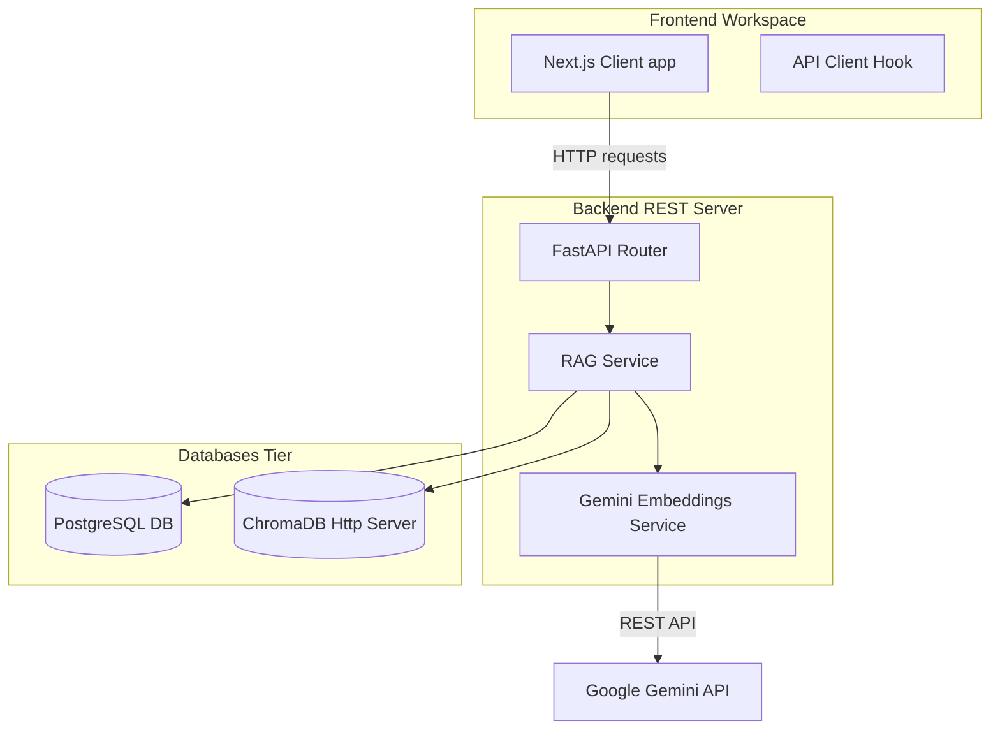
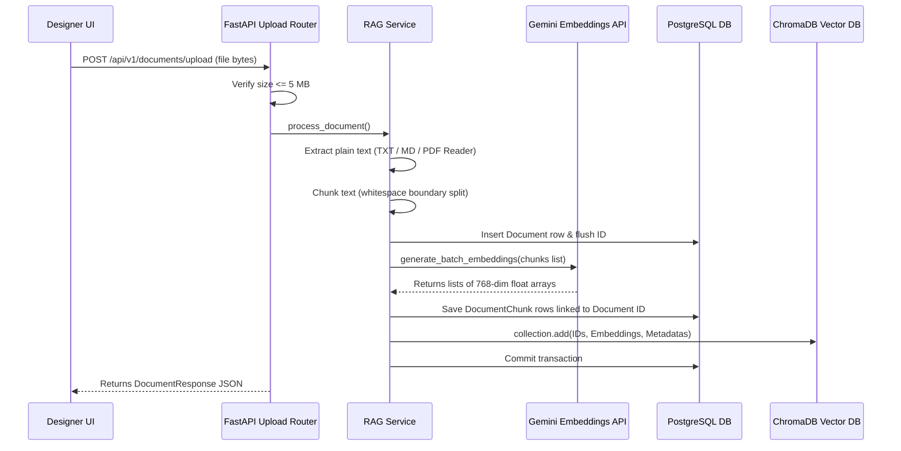
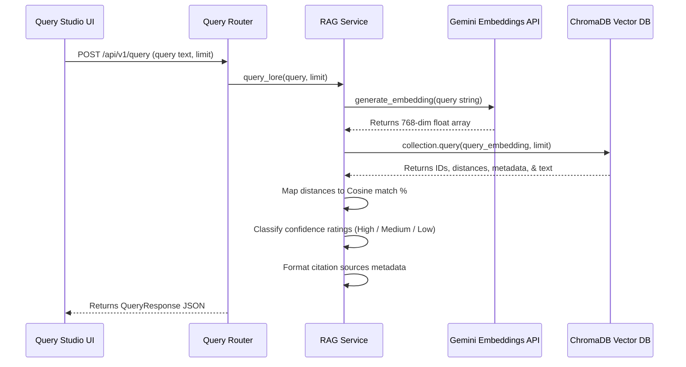

# GameMind: System Architecture Documentation

This document describes the architectural layout, components, and data flows of **GameMind (Release 1)**.

---

## 1. System Overview

GameMind is a developer-facing narrative engine and workspace catalog. It allows game studio narrative designers to ingest game world lore and run vector-based semantic queries.

The platform is divided into three primary runtime tiers:
1. **Next.js Frontend Workspace:** Client dashboard designed around Linear/Vercel visual guidelines. Exposes interfaces to upload documents and run test queries.
2. **FastAPI Backend Services:** Exposes REST API endpoints for configuration health verification, lore asset management, and vector indexing services.
3. **Storage Tier:**
   - **PostgreSQL Database:** Stores transactional document metadata and chunk index mapping tables.
   - **ChromaDB Vector Database:** Houses embedded floating-point representation arrays for fast semantic calculations.

---

## 2. Component Architectures

### Backend Architecture
Built with **FastAPI** using a repository-like layout pattern:
- **Router Layer:** Maps endpoints, validates incoming schema structures using Pydantic, and returns JSON serialization bodies.
- **Service Layer:** Houses modular business operations (text parsing, whitespace chunking, embedding calling, database synchronizations).
- **Database Session Manager:** Exposes transactional contexts using SQLAlchemy engine pools.

### Frontend Architecture
Built with **Next.js (App Router)** and TypeScript:
- **Navigation Shell:** Linear-style persistent sidebar layout with health check loops.
- **Top Command Bar:** Search mockup trigger displaying keyboard shortcut keycaps (`Ctrl + K`).
- **Command Palette:** Raycast-style overlay dialog showing filtered command paths.
- **Tables Catalog:** High-density Vercel-style tables mapping document attributes.

### Database Architecture (PostgreSQL)
Tracks file configurations and indices:
- **`documents` Table:** Stores file title, format type (`TXT`, `MD`, `PDF`), and created timestamps.
- **`document_chunks` Table:** Links text blocks to parent documents (`document_id` foreign key with cascade deletions enabled).

### Vector Database Architecture (ChromaDB)
Houses dense semantic arrays inside a single collection named `lore_chunks`.
- **Similarity Metric:** **Cosine distance** space (`"hnsw:space": "cosine"`).
- **Indexing Fields:** Coordinates `document_id`, `title`, and `chunk_index` metadata keys.

### Gemini API Integration
Exposes embeddings via the new `google-genai` client using the `text-embedding-004` model. Fetches batch vectors in a single request to accelerate multi-paragraph processing.

---

## 3. Core Data Flows

### Document Upload Flow

### Query Flow

---

## 4. Folder Responsibility Documentation

| Folder Path | Purpose / Responsibilities |
| :--- | :--- |
| **`backend/app/api`** | Declares FastAPI endpoint routes (CORS policies, tags, response mapping). |
| **`backend/app/services`** | Stores business operations (Gemini API clients, RAG text parser/chunkers). |
| **`backend/app/models`** | Contains SQLAlchemy data structures representing database tables. |
| **`backend/app/schemas`** | Houses Pydantic models for incoming request bodies and outgoing JSON validation schemas. |
| **`backend/app/database`** | Manages SQLAlchemy engine initialization, session configurations, and local session dependencies. |
| **`frontend/src/app`** | Houses Next.js page components, folders mapping routes, and styling configurations. |
| **`frontend/src/components`** | Reusable frontend components (e.g. sidebars, command palettes). |
| **`frontend/src/lib`** | Client utilities (e.g. the `api.ts` fetch layer wrapper). |
