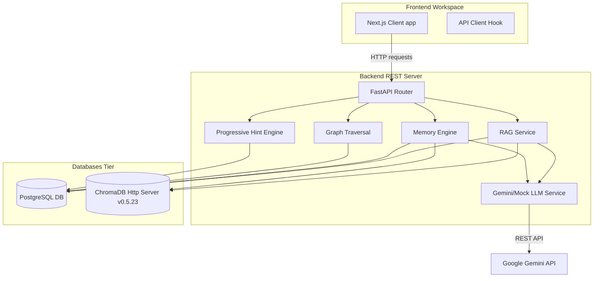
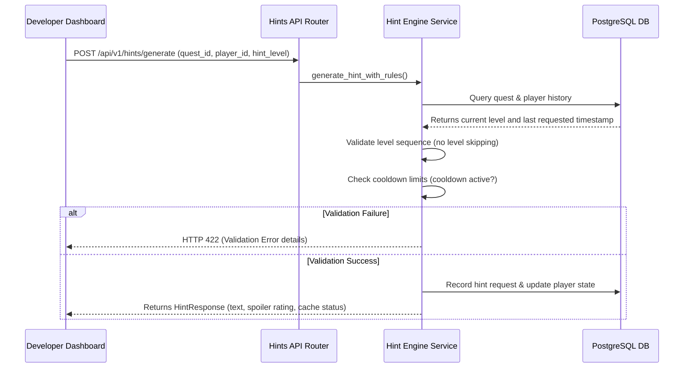

# GameMind: System Architecture Documentation

This document describes the architectural layout, components, and data flows of **GameMind (Release 3C.3)**.

---

## 1. System Overview

GameMind is an advanced developer narrative workspace that integrates semantic retrieval, character generation, knowledge graphs, and progression testing into a single system.

The platform is structured into three primary runtime tiers:
1. **Next.js Frontend Workspace:** Client dashboard designed around Vercel/Linear visual guidelines. Exposes editors for documents, NPC profiles, dialogue debuggers, progressive hint testing panels, and real-time telemetry dashboards.
2. **FastAPI Backend Services:** Houses REST endpoints for lore indexing, graph traversal, conversation planning, memory retrieval, and progressive hints.
3. **Storage Tier:**
   - **PostgreSQL Database:** Tracks relational schemas for documents, chunks, NPC profiles, world state nodes, relationships, active quests, and conversation logs.
   - **ChromaDB Vector Database:** Stores dense 768-dimensional embeddings generated by Gemini (`text-embedding-004`) for fast semantic retrieval of lore and memories.

---

## 2. Component Architectures

### Backend Modules
The FastAPI backend imports and organizes business services under the following namespaces:
- **Documents & Query:** Processes text ingestion and performs vector similarity search.
- **NPCs & Dialogue:** Manages static character profiles and generates prompts or chat completions using live Gemini or mock LLM providers.
- **Graph & State:** Builds entities and relationships. Traverses nodes using DFS/BFS algorithms to resolve world constraints.
- **Memories:** Tracks episodic player interactions and updates rankings using graph-proximity boosting.
- **Quests & Hints:** Validates objectives progression and escalates hint levels while enforcing cooldown blocks.
- **Analytics:** Serves aggregated logs and cost metrics for developer review.

### Database Architecture (PostgreSQL Schema)
The PostgreSQL database handles the following entities:
- `documents` / `document_chunks`: Stores text files and matching paragraph indexes.
- `npc_profiles`: Represents name, slug, personality, dialogue style, voice, and faction.
- `npc_memories`: Stores memories linked to specific NPCs with importance scores.
- `relationships` / `world_states`: Tracks graph nodes, weights, and priority states.
- `quests`: Stores registered quests, golds, XP, and objective definitions.
- `conversation_logs` / `telemetry_logs`: Audits LLM token consumption and error states.

### Vector Index Architecture (ChromaDB)
ChromaDB exposes two distinct persistent collections:
1. `lore_chunks`: Stores lore text blocks mapped to source document IDs.
2. `npc_memories`: Stores episodic character memories.
Both collections use **Cosine distance** (`"hnsw:space": "cosine"`) for similarity metrics and clamp vector query limits dynamically against collection sizes to avoid index-range errors.

---

## 3. Sequential Data Flows

### Progressive Hint Generation Flow

---

## 4. Directory Organization

| Folder Path | Purpose / Responsibilities |
| :--- | :--- |
| **`backend/app/api`** | Declares FastAPI endpoint routes (CORS, requests parsing, routing). |
| **`backend/app/services`** | Implements core business logic (RAG pipeline, memory ranking, graph traversals, hint checking). |
| **`backend/app/models`** | Contains SQLAlchemy data structures representing database tables. |
| **`backend/app/schemas`** | Houses Pydantic models for request/response serialization. |
| **`backend/app/workers`** | Contains background workers (e.g. cleanup loop for active locks/logs). |
| **`frontend/src/app`** | Houses Next.js page routes (`/hints`, `/npcs`, `/query`, `/analytics`). |
| **`frontend/src/components`** | Visual layouts (Sidebars, Dialog modals, Command Palettes). |
| **`frontend/src/lib`** | Client integrations (TypeScript api wrapper). |
