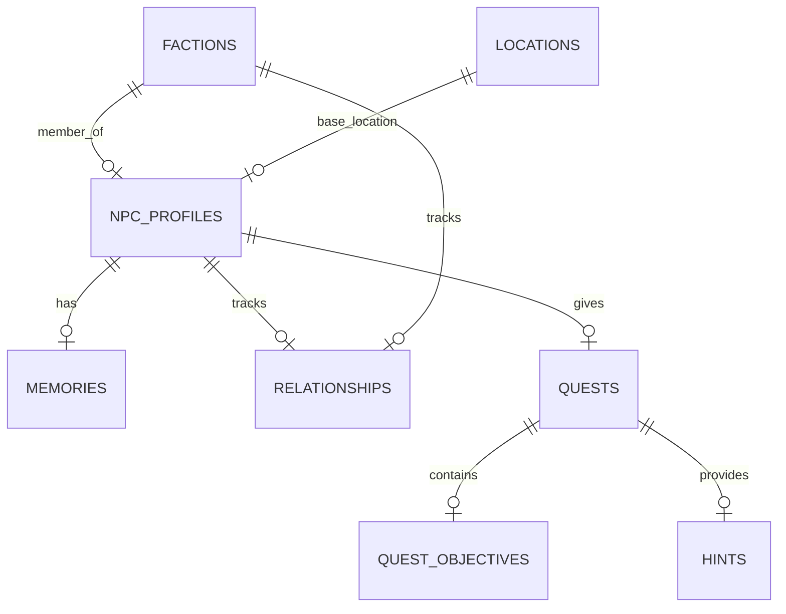

# GameMind: Domain Model Specification

This document defines the core domain entities, database mappings, relationships, JSON shapes, and future usages for **Release 2 (Gameplay Content Layer)** and **Release 3 (World Intelligence Layer)**.

---

## 1. Domain Entities & Database Mappings



---

### Entity 1: NPC Profile (`npc_profiles`)
* **Purpose:** Stores the static personality archetype, dialogue styling constraints, animations, and voice definitions for a character.
* **Attributes:**
  - `id` (`VARCHAR(100)`, Primary Key) - unique URL-safe slug (e.g. `eldrin_mage`).
  - `name` (`VARCHAR(100)`, Not Null) - display name.
  - `title` (`VARCHAR(100)`, Nullable) - NPC rank or title.
  - `personality_summary` (`TEXT`, Not Null) - core character summary.
  - `dialogue_style` (`TEXT`, Nullable) - dialogue speech guidelines.
  - `voice_profile` (`VARCHAR(100)`, Nullable) - TTS engine parameters.
  - `animation_hints` (`JSONB`, Nullable) - maps idle/talking emotion triggers.
  - `created_at` / `updated_at` (`TIMESTAMP WITH TIME ZONE`)
* **Relationships:**
  - Has many `Memories` (`npc_profiles.id` -> `memories.npc_id`)
  - Has many `Relationships` (`npc_profiles.id` -> `relationships.npc_id`)
  - Has many `Quests` (`npc_profiles.id` -> `quests.npc_id`)
* **Example JSON:**
  ```json
  {
    "id": "eldrin_mage",
    "name": "Eldrin",
    "title": "Archmage of the Watchtower",
    "personality_summary": "Cautious and scholarly librarian who speaks in warning tones.",
    "dialogue_style": "Uses formal language, hesitates frequently, and references history.",
    "voice_profile": "elderly-gravelly-english",
    "animation_hints": {
      "neutral": "idle_read",
      "concerned": "shake_head",
      "excited": "gesticulate"
    }
  }
  ```
* **Future Usage:** Feeds the Dialogue Engine prompts to shape character voice and animation cues in provider-generated outputs.

---

### Entity 2: Faction (`factions`)
* **Purpose:** Represents world organizations, kingdoms, or guilds that control locations and influence reputations.
* **Attributes:**
  - `id` (`VARCHAR(100)`, Primary Key) - e.g. `cinder_vanguard`.
  - `name` (`VARCHAR(100)`, Not Null) - faction name.
  - `description` (`TEXT`, Not Null) - faction description.
  - `base_location_id` (`VARCHAR(100)`, Nullable) - home base foreign key.
* **Relationships:**
  - Has many `NPCProfiles` (faction membership).
  - Has many `Relationships` (standing).
* **Example JSON:**
  ```json
  {
    "id": "cinder_vanguard",
    "name": "Cinder Vanguard",
    "description": "Splinter military faction of the Vulcanan Flame Legions occupying Frostpeak.",
    "base_location_id": "frostpeak_citadel"
  }
  ```
* **Future Usage:** Shapes reputation modifiers and locks specific quests behind faction loyalty gates.

---

### Entity 3: Location (`locations`)
* **Purpose:** Models worlds, zones, and cities, scoping where entities are located.
* **Attributes:**
  - `id` (`VARCHAR(100)`, Primary Key) - e.g. `ash_pass`.
  - `name` (`VARCHAR(100)`, Not Null) - zone name.
  - `description` (`TEXT`, Not Null) - location history.
* **Relationships:**
  - Has many `NPCProfiles` (current location references).
* **Example JSON:**
  ```json
  {
    "id": "ash_pass",
    "name": "Ash Pass",
    "description": "Volcanic mountain corridor linking Frostpeak and Vulcana."
  }
  ```
* **Future Usage:** Filters RAG searches so NPCs do not speak of events outside their localized knowledge boundaries.

---

### Entity 4: Quest (`quests`)
* **Purpose:** Represents side-quests generated for players.
* **Attributes:**
  - `id` (`UUID`, Primary Key, default `gen_random_uuid()`)
  - `npc_id` (`VARCHAR(100)`, Foreign Key references `npc_profiles.id`)
  - `title` (`VARCHAR(255)`, Not Null)
  - `difficulty` (`VARCHAR(50)`, Not Null)
  - `rewards` (`JSONB`, Not Null) - maps gold, xp, items.
  - `created_at` (`TIMESTAMP WITH TIME ZONE`)
* **Relationships:**
  - Belongs to `NPCProfile`.
  - Has many `QuestObjectives` (cascade deletes).
  - Has many `Hints`.
* **Example JSON:**
  ```json
  {
    "id": "a1b2c3d4-e5f6-7a8b-9c0d-1e2f3a4b5c6d",
    "npc_id": "eldrin_mage",
    "title": "Unlocking the Geothermal Exhaust",
    "difficulty": "Medium",
    "rewards": {
      "gold": 250,
      "xp": 800,
      "items": ["Sky-iron Wrench"]
    }
  }
  ```
* **Future Usage:** Tracked in game sessions to determine NPC dialogue options (e.g. quest accepted vs. completed).

---

### Entity 5: Quest Objective (`quest_objectives`)
* **Purpose:** Tracks detailed task requirements within a specific quest.
* **Attributes:**
  - `id` (`UUID`, Primary Key)
  - `quest_id` (`UUID`, Foreign Key references `quests.id` ON DELETE CASCADE)
  - `description` (`TEXT`, Not Null) - e.g. 'Defeat 5 Lava Slimes'
  - `target_type` (`VARCHAR(50)`, Not Null) - e.g. 'kill', 'retrieve', 'speak'
  - `target_id` (`VARCHAR(100)`, Not Null) - ID of enemy, item, or location.
  - `is_completed` (`BOOLEAN`, default `FALSE`)
* **Relationships:**
  - Belongs to `Quest`.
* **Example JSON:**
  ```json
  {
    "id": "fb23-910a",
    "quest_id": "a1b2c3d4-e5f6-7a8b-9c0d-1e2f3a4b5c6d",
    "description": "Retrieve the Geothermal Valve from Ash Pass",
    "target_type": "retrieve",
    "target_id": "geothermal_valve",
    "is_completed": false
  }
  ```
* **Future Usage:** Validated by the Quest Service when player submits quest completion requests.

---

### Entity 6: Hint (`hints`)
* **Purpose:** Stores progressive levels of assistance for specific quests.
* **Attributes:**
  - `id` (`UUID`, Primary Key)
  - `quest_id` (`UUID`, Foreign Key references `quests.id` ON DELETE CASCADE)
  - `level` (`INT`, Not Null) - `1` (Subtle), `2` (Moderate), `3` (Direct).
  - `content` (`TEXT`, Not Null) - hint description.
* **Relationships:**
  - Belongs to `Quest`.
* **Example JSON:**
  ```json
  {
    "id": "h-110",
    "quest_id": "a1b2c3d4-e5f6-7a8b-9c0d-1e2f3a4b5c6d",
    "level": 1,
    "content": "Eldrin mentions the valve was lost near the volcanic vents. Look for steam plumes in Ash Pass."
  }
  ```
* **Future Usage:** Exposes progressive hints dynamically to the player UI.

---

### Entity 7: Memory (`memories`)
* **Purpose:** Retains prior conversation highlights and player activities to build NPC memory context.
* **Attributes:**
  - `id` (`UUID`, Primary Key)
  - `npc_id` (`VARCHAR(100)`, Foreign Key references `npc_profiles.id` ON DELETE CASCADE)
  - `type` (`VARCHAR(50)`, Not Null) - `short_term` (chat logs) or `long_term` (summarized facts).
  - `content` (`TEXT`, Not Null) - memory description.
  - `importance_score` (`INT`, default `5`) - importance rating (1 to 10).
  - `created_at` (`TIMESTAMP WITH TIME ZONE`)
* **Relationships:**
  - Belongs to `NPCProfile`.
* **Example JSON:**
  ```json
  {
    "id": "m-8910",
    "npc_id": "eldrin_mage",
    "type": "long_term",
    "content": "Player retrieved the Sky-iron Wrench and repaired the main citation generator core.",
    "importance_score": 8,
    "created_at": "2026-06-14T11:00:00Z"
  }
  ```
* **Future Usage:** RAG-indexed inside short-term summaries, injected into conversational prompt bounds.

---

### Entity 8: Relationship (`relationships`)
* **Purpose:** Represents player reputation metrics with NPCs or Factions.
* **Attributes:**
  - `id` (`UUID`, Primary Key)
  - `npc_id` (`VARCHAR(100)`, Nullable, Foreign Key references `npc_profiles.id`)
  - `faction_id` (`VARCHAR(100)`, Nullable, Foreign Key references `factions.id`)
  - `trust` (`INT`, default `50`) - range 0 to 100.
  - `friendship` (`INT`, default `50`) - range 0 to 100.
  - `fear` (`INT`, default `0`) - range 0 to 100.
  - `respect` (`INT`, default `50`) - range 0 to 100.
* **Relationships:**
  - Belongs to `NPCProfile` or `Faction`.
* **Example JSON:**
  ```json
  {
    "id": "r-1102",
    "npc_id": "eldrin_mage",
    "faction_id": null,
    "trust": 85,
    "friendship": 60,
    "fear": 0,
    "respect": 75
  }
  ```
* **Future Usage:** Modifies the system dialogue prompt templates (e.g. friendly vs. hostile responses).

---

### Entity 9: World Event (`world_events`)
* **Purpose:** Models active state occurrences changing world scenarios.
* **Attributes:**
  - `id` (`VARCHAR(100)`, Primary Key) - e.g. `siege_active`.
  - `title` (`VARCHAR(255)`, Not Null)
  - `description` (`TEXT`, Not Null)
  - `is_active` (`BOOLEAN`, default `TRUE`)
* **Relationships:**
  - None.
* **Example JSON:**
  ```json
  {
    "id": "siege_active",
    "title": "The Ember Siege",
    "description": "Vulcana Flame Legions block geothermal cores beneath the citadel.",
    "is_active": true
  }
  ```
* **Future Usage:** Checked by Dialogue and Quest systems to customize world status references.
