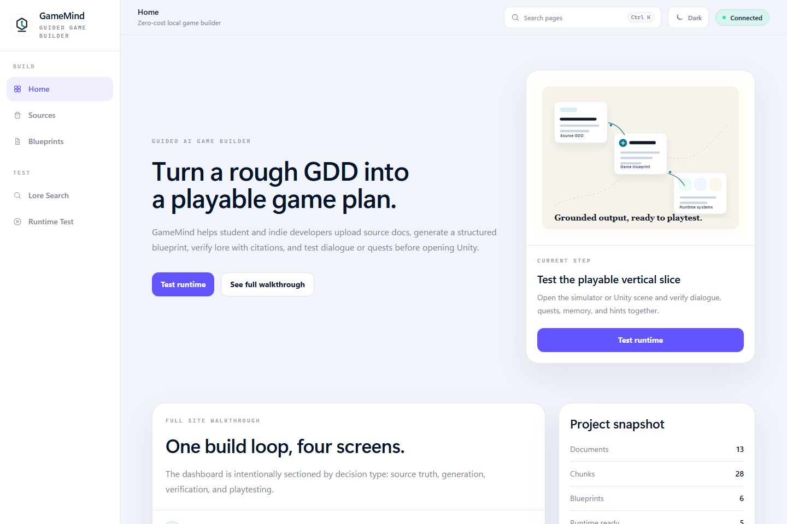
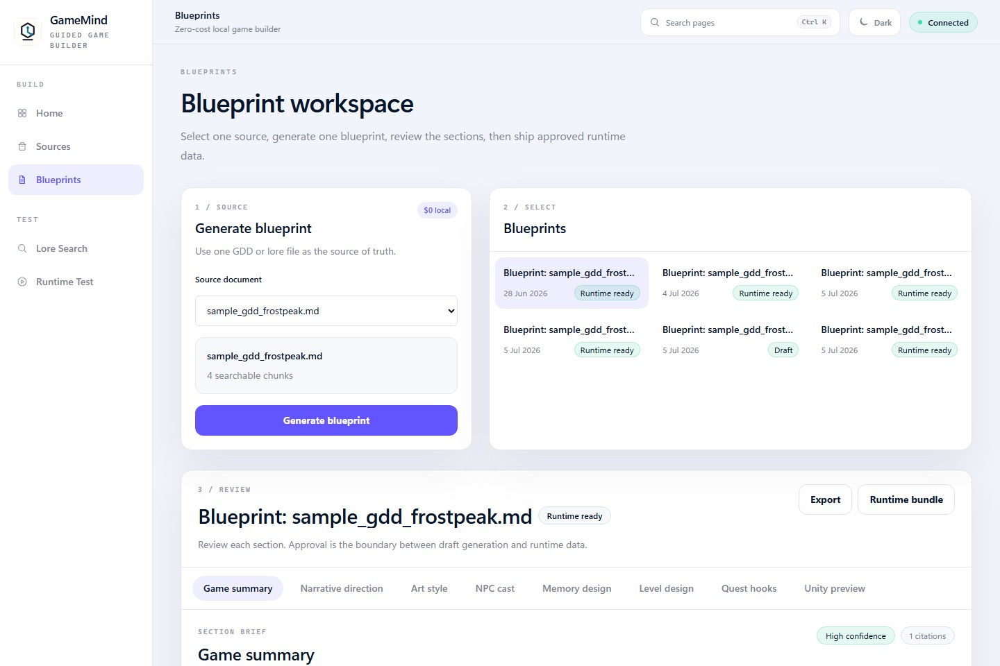
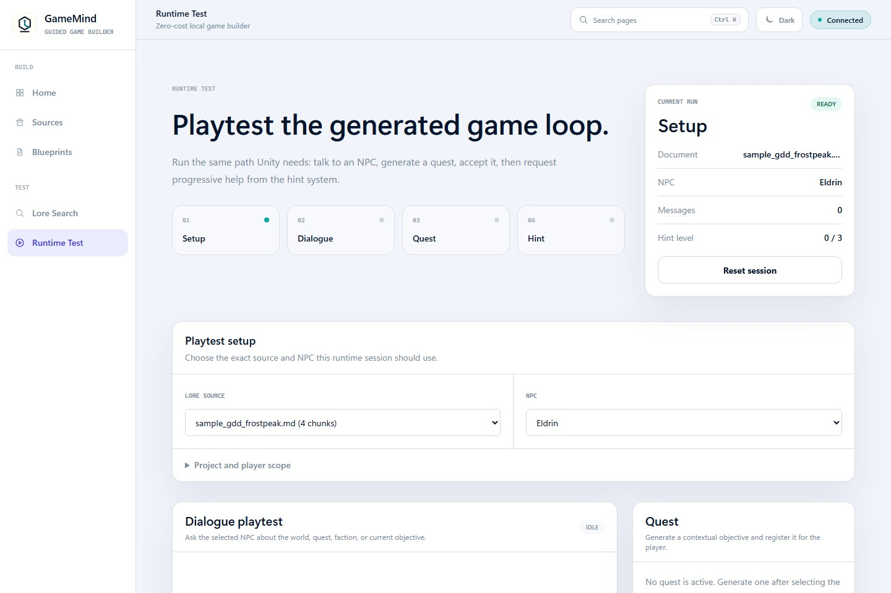

<p align="center">
  
</p>

# GameMind

GameMind is an AI-powered game design co-pilot and Unity runtime assistant for students, new game developers, and indie teams. It turns uploaded game design documents, lore files, NPC notes, quest ideas, and level concepts into structured game systems that can be reviewed in a dashboard and exported for Unity.

The project combines a FastAPI backend, PostgreSQL, ChromaDB vector search, a Next.js developer dashboard, and Unity C# runtime scripts. It is designed to run in a zero-cost local demo mode without mandatory paid AI APIs, while keeping the AI provider layer optional and swappable.

**Short description:** Local-first AI game builder that converts GDDs into grounded blueprints, NPCs, quests, memory, hints, and Unity-ready runtime data.

## Demo Preview

| Guided workspace | Blueprint review | Runtime test |
| --- | --- | --- |
|  |  |  |

## Why This Exists

New game developers often have ideas, lore, and rough documents, but struggle to convert them into implementation-ready game systems. Generic chatbots can brainstorm, but they do not know the project state, cannot enforce runtime contracts, and do not naturally produce data Unity can consume.

GameMind focuses on the full game-building loop:

```text
Upload GDD -> Search grounded lore -> Generate blueprint -> Materialize runtime data -> Test dialogue, quests, and hints -> Connect Unity
```

The goal is not to replace a designer or developer. The goal is to give early teams a practical assistant that keeps narrative, characters, quests, memory, and runtime data connected.

## What It Does

- Upload and index game documents such as GDDs, lore files, character notes, and quest rules.
- Query the lore index with citations, confidence scores, and local Chroma retrieval.
- Generate game blueprints from uploaded GDDs using local rules, templates, and schema validation.
- Review narrative direction, art style direction, NPC archetypes, memory design, level suggestions, quest hooks, and Unity runtime previews.
- Manage NPC profiles, quests, world state, memory, dialogue assembly, progressive hints, and analytics.
- Export structured JSON that Unity can consume for NPC dialogue, quests, hints, emotions, and animation suggestions.

## How It Is Different From ChatGPT/Codex/Claude

GameMind is not a general chat interface. It is a project-specific game-building workflow.

- **Grounded in project files:** responses trace back to uploaded GDD/lore chunks.
- **Structured outputs:** blueprints, NPCs, quests, memories, and world flags use API contracts instead of free-form chat.
- **Runtime aware:** the system prepares data for Unity rather than stopping at text suggestions.
- **Repeatable workflow:** every project follows the same path from source document to runtime test.
- **Zero-cost MVP:** the current demo works locally without a paid LLM key.

Generic AI agents help write code or brainstorm. GameMind demonstrates how an AI system can become part of a game development pipeline.

## Tech Stack

- **Frontend:** Next.js, TypeScript
- **Backend:** FastAPI, Python, SQLAlchemy, Alembic
- **Database:** PostgreSQL
- **Vector Search:** ChromaDB
- **Game Runtime:** Unity, C#
- **Infrastructure:** Docker Compose
- **AI Mode:** zero-cost local demo by default, optional provider integrations

## Architecture

```text
Next.js Dashboard
  -> FastAPI REST API
    -> PostgreSQL for durable project data
    -> ChromaDB for local document retrieval
    -> Local rule/template providers for zero-cost generation
    -> Optional future hosted provider interface
  -> Unity C# client consumes runtime endpoints
```

Core backend areas:

- **Document ingestion:** stores source documents and chunks.
- **RAG retrieval:** searches local vector indexes and returns citations.
- **Blueprint generation:** extracts structured game design sections from source evidence.
- **Materialization:** converts approved blueprints into NPCs, quests, memories, and world flags.
- **Runtime APIs:** provide dialogue, quest, hint, and Unity bundle responses.
- **Telemetry:** records runtime behavior, costs, errors, and memory diagnostics.

## Project Structure

```text
backend/        FastAPI app, services, models, migrations, tests
frontend/       Next.js developer dashboard
Unity/          Unity C# runtime integration scripts
docs/demo/      Demo GDD used for the blueprint golden path
docker-compose.yml
```

## Zero-Cost AI Policy

The default project mode is local-first:

- No external model key is required.
- No paid hosted model key is required.
- ChromaDB local embeddings are used for the demo retrieval path.
- Rule/template generation is used for blueprint and runtime behavior in the MVP.
- NVIDIA API settings exist only as future optional placeholders.

If a hosted provider is added later, it should remain optional and should not break the local demo workflow.

## Local Setup

1. Copy the environment example:

```bash
cp .env.example .env
```

2. Start backend services:

```bash
docker compose up -d --build
```

This starts PostgreSQL, ChromaDB, and the FastAPI backend. Backend migrations run automatically on local container startup.

3. Start the dashboard:

```bash
cd frontend
npm install
npm.cmd run dev
```

Open:

```text
http://localhost:3000
http://localhost:8000/docs
```

## Verification

Run backend tests:

```bash
docker exec gamemind_backend pytest
```

Run frontend checks:

```bash
cd frontend
npm.cmd run lint
npm.cmd run build
```

Check backend health:

```bash
curl http://localhost:8000/health
```

Expected local demo mode:

```json
{
  "status": "healthy",
  "database": "healthy",
  "chromadb": "healthy",
  "ai_mode": "local_demo",
  "llm_provider": "mock",
  "embedding_provider": "chroma_default",
  "vector_collection": "lore_chunks_local",
  "vector_dimension": 384
}
```

## Demo Flow

1. Open **Sources** and click **Load Frostpeak demo**. You can also manually upload `docs/demo/sample_gdd_frostpeak.md`.
2. Open **Blueprints**.
3. Generate a blueprint from the uploaded GDD.
4. Review all generated sections with citations, confidence, and warnings.
5. Approve and materialize the blueprint into runtime records.
6. Use the simulator or Unity scripts to test NPC dialogue, quests, and hint flows.

For a presenter-friendly walkthrough, use [docs/demo/demo_runbook.md](docs/demo/demo_runbook.md).
For a short recording script, use [docs/demo/demo_script.md](docs/demo/demo_script.md).
For release readiness, use [docs/demo/mvp_acceptance_checklist.md](docs/demo/mvp_acceptance_checklist.md).

## Current MVP Status

Implemented:

- Local document upload and demo GDD loading.
- Local Chroma retrieval with citations.
- Blueprint generation and review.
- Blueprint approval and materialization.
- NPC, quest, memory, world flag, dialogue, and hint backend flows.
- Next.js dashboard for the core workflow.
- Unity C# API client and vertical-slice scene scripts.
- Alembic migrations and project-scoped database isolation.
- Backend and frontend verification gates.

Remaining product work:

- Improve Unity scene presentation and click/interaction polish.
- Add richer blueprint quality checks for weak GDDs.
- Add a cleaner public demo video/GIF.
- Add optional hosted provider implementation behind the existing provider interface.
- Continue simplifying dashboard pages around the main indie-dev workflow.

## Production Notes

Local development runs migrations automatically in the backend container. Production deployments should run `alembic upgrade head` as a separate migration job before application replicas start.

The main demo path is intentionally local-first and works without paid API usage. Future hosted model integrations, such as NVIDIA API support, should be added through the provider interface without changing the dashboard workflow. Do not put real API keys in Git; use local `.env` values or deployment secrets.
