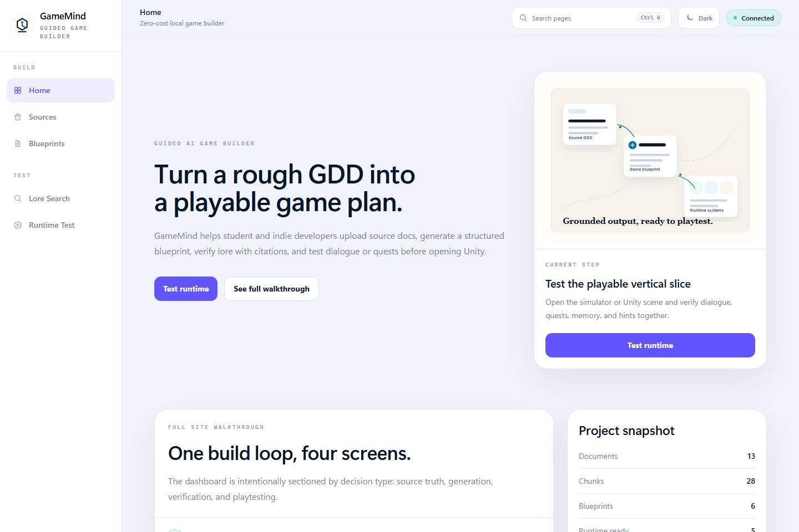
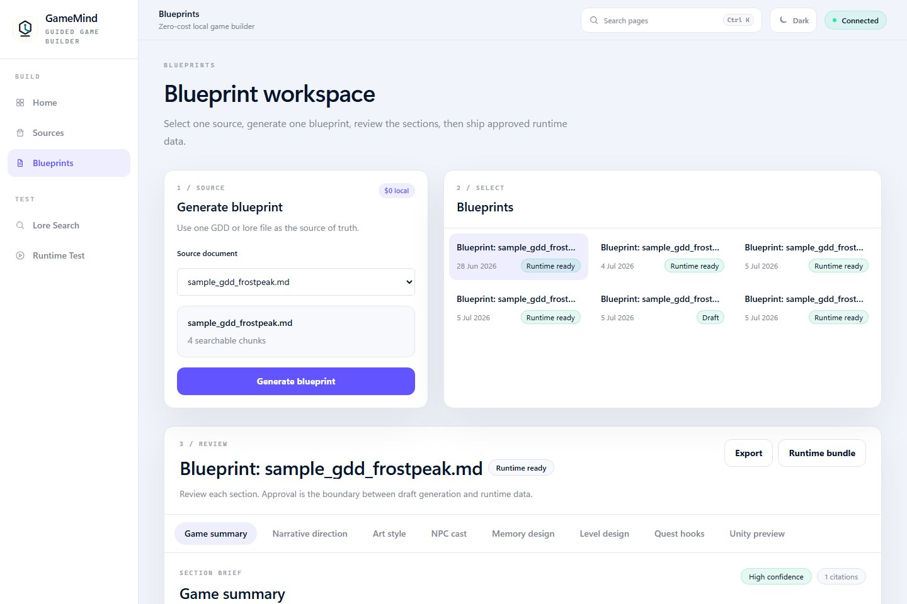
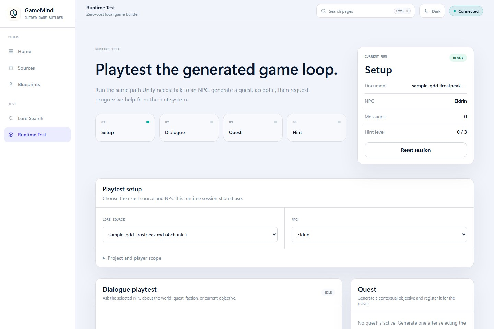

<p align="center">
  
</p>

# GameMind

GameMind is a local-first AI game design and runtime intelligence platform for students, new game developers, and indie teams. It turns uploaded game design documents, lore files, NPC notes, quest ideas, and level concepts into structured game systems that can be reviewed in a dashboard, exported for a team, or consumed by a game runtime.

The project combines a FastAPI backend, LangGraph orchestration, PostgreSQL,
ChromaDB vector search, a Next.js developer dashboard, and Unity C# runtime
scripts. It is designed to run in a zero-cost local demo mode without mandatory
paid AI APIs, while keeping the AI provider layer optional and swappable.

**Short description:** Local-first AI game builder that converts GDDs into grounded blueprints, NPCs, quests, memory, hints, and engine-ready runtime data.

## Demo Preview

| Guided workspace | Blueprint review | Runtime test |
| --- | --- | --- |
|  |  |  |

## Why This Exists

New game developers often have ideas, lore, and rough documents, but struggle to convert them into implementation-ready game systems. Generic chatbots can brainstorm, but they do not know the project state, cannot enforce runtime contracts, and do not naturally produce data Unity can consume.

GameMind supports two connected workflows:

```text
Dashboard Workspace
Upload GDD -> Search grounded lore -> Generate blueprint -> Review/export design systems
```

```text
Runtime Integration
Approve blueprint -> Materialize runtime data -> Test dialogue, quests, and hints -> Connect a game client
```

The goal is not to replace a designer or developer. The goal is to give early teams a practical assistant that keeps narrative, characters, quests, memory, and runtime data connected.

## Two Product Modes

### 1. Dashboard Workspace

Use GameMind as a game design command center without integrating a game engine.

- Create a named workspace for each game.
- Upload GDDs, lore files, NPC sheets, quest notes, level briefs, and technical constraints.
- Review a GDD for missing decisions, conflicts, and unsupported assumptions.
- Track and resolve design decisions against source evidence.
- Generate multi-source blueprints for narrative, art direction, NPCs, quests, memory, level ideas, and gameplay systems.
- Open section-level evidence and export a portable Markdown project brief.

This mode is useful for students, writers, designers, and indie teams that need help organizing a game before runtime integration.

## Core Dashboard Workflow

The dashboard is deliberately organised around one clear path:

```text
Workspace -> Sources -> GDD review -> Decisions -> Blueprint -> Evidence -> Project brief
```

1. Create or select a **workspace**. A workspace scopes documents, decisions, blueprints, and runtime data to one game.
2. In **Sources**, add a GDD or supporting notes. GameMind identifies the source type, rejects exact duplicate content, and preserves later uploads as revisions instead of overwriting evidence.
3. Open the source review to see what is specified, what conflicts, and which product decisions still need an answer.
4. Use **Decisions** to resolve those questions in one place. When a decision needs a technical brief, download the local template, complete its placeholders, upload it as a **Technical brief**, attach it to the decision, and then mark the decision resolved.
5. In **Blueprints**, choose a primary GDD and, when useful, add supporting source documents. Review structured sections, warnings, readiness, and citations before approving anything.
6. Open a citation to inspect the exact source chunk, then export the blueprint as a Markdown project brief for a teammate, portfolio review, or implementation handoff.

Runtime materialization is optional and comes only after the blueprint is reviewed. This keeps the dashboard useful for planning even when a team has no engine integration yet.

### 2. Runtime Integration

Use GameMind as a backend intelligence layer for an actual game client.

- Fetch approved runtime bundles.
- Ask NPC dialogue questions.
- Request progressive hints.
- Sync quest state and world flags.
- Map emotion and animation suggestions into a client-specific presentation layer.
- Connect Unity today, or build a Godot, Unreal, web, or custom REST adapter later.

Unity is included as one proof-of-integration adapter. It is not the whole product.

## What It Does

- Upload and index game documents such as GDDs, lore files, character notes, and quest rules.
- Keep source lineages through revisions and prevent duplicate files from polluting a workspace.
- Query the lore index with citations, confidence scores, and local Chroma retrieval.
- Generate source-grounded, multi-source game blueprints with local rules, templates, and schema validation.
- Review narrative direction, art style direction, NPC archetypes, memory design, level suggestions, gameplay systems, quest hooks, and runtime previews.
- Turn missing or conflicting GDD details into visible, resolvable design decisions.
- Run a durable design-agent workflow that plans, retrieves evidence, generates,
  critiques, pauses for approval, revises after rejection, and finalizes an
  immutable blueprint.
- Trace each generated section to its source chunks and export a team-facing Markdown brief.
- Manage NPC profiles, quests, world state, memory, dialogue assembly, progressive hints, and analytics.
- Export structured JSON that Unity or another game client can consume for NPC dialogue, quests, hints, emotions, and animation suggestions.

## How It Is Different From ChatGPT/Codex/Claude

GameMind is not a general chat interface. It is a project-specific game-building workflow.

- **Grounded in project files:** responses trace back to uploaded GDD/lore chunks.
- **Structured outputs:** blueprints, NPCs, quests, memories, and world flags use API contracts instead of free-form chat.
- **Runtime aware:** the system prepares data for game clients rather than stopping at text suggestions.
- **Repeatable workflow:** every project follows the same path from source document to runtime test.
- **Zero-cost MVP:** the current demo works locally without a paid LLM key.

Generic AI agents help write code or brainstorm. GameMind demonstrates how an AI system can become part of a game development pipeline.

## Tech Stack

- **Frontend:** Next.js, TypeScript
- **Backend:** FastAPI, Python, LangGraph, LangChain Core, SQLAlchemy, Alembic
- **Database:** PostgreSQL
- **Vector Search:** ChromaDB
- **Game Runtime:** Unity, C#
- **Infrastructure:** Docker Compose
- **AI Mode:** zero-cost local demo by default, optional provider integrations

## Architecture

```text
Next.js Dashboard
  -> FastAPI REST API
    -> PostgreSQL for durable project data
    -> LangGraph for checkpointed design-agent workflows and human review
    -> ChromaDB for local document retrieval
    -> Local rule/template providers for zero-cost generation
    -> Optional future hosted provider interface
  -> Runtime clients consume stable REST contracts
     -> Unity adapter
     -> Future Godot/Unreal/custom clients
```

Core backend areas:

- **Document ingestion:** stores source documents and chunks.
- **RAG retrieval:** searches local vector indexes and returns citations.
- **Design agent:** orchestrates plan, retrieval, generation, critique, human
  review, revision, and immutable finalization with PostgreSQL checkpoints.
- **Blueprint generation:** extracts structured game design sections from source evidence.
- **Materialization:** converts approved blueprints into NPCs, quests, memories, and world flags.
- **Runtime APIs:** provide dialogue, quest, hint, and Unity bundle responses.
- **Telemetry:** records runtime behavior, costs, errors, and memory diagnostics.

## Project Structure

```text
backend/        FastAPI app, services, models, migrations, tests
frontend/       Next.js developer dashboard
Unity/          Unity C# runtime adapter and vertical-slice scene
docs/demo/      Demo GDD and presentation runbooks
docs/workflows/ Dashboard workspace workflows
docs/integrations/ Runtime API and engine integration docs
docker-compose.yml
```

## Zero-Cost AI Policy

The default project mode is local-first:

- No external model key is required.
- No paid hosted model key is required.
- ChromaDB local embeddings are used for the demo retrieval path.
- Rule/template generation is used for blueprint and runtime behavior in the MVP.
- The durable design-agent workflow uses its deterministic mock provider by default.
- NVIDIA-hosted design-agent inference is optional and disabled by default.

Selecting NVIDIA never changes the retrieval or workflow architecture. If NVIDIA
is unavailable and fallback is enabled, the run continues through the mock
provider and is explicitly marked as degraded in its run response and trace.
Hosted-provider cost is reported as unavailable unless an authoritative price is
configured; it is never presented as a fabricated `$0`.

To opt into NVIDIA locally, set these values only in `.env`:

```env
DESIGN_AGENT_PROVIDER=nvidia
DESIGN_AGENT_FALLBACK_TO_MOCK=true
NVIDIA_API_KEY=your-local-secret
```

Planner, generator, critic, and revision model names can be configured
independently using the optional `NVIDIA_*_MODEL_NAME` settings documented in
`.env.example`. Never commit a real API key.

## Local Setup

1. Copy the environment example:

```bash
cp .env.example .env
```

2. Start backend services:

```bash
docker compose up -d --build
```

This starts PostgreSQL, ChromaDB, and the FastAPI backend. Backend migrations run automatically on local container startup.

3. Start the dashboard:

```bash
cd frontend
npm install
npm.cmd run dev
```

Open:

```text
http://localhost:3000
http://localhost:8000/docs
```

## Verification

Run backend tests:

```bash
docker exec gamemind_backend pytest -q
```

Run frontend checks:

```bash
cd frontend
npm.cmd run lint
npm.cmd run build
```

Check backend health:

```bash
curl http://localhost:8000/health
```

Expected local demo mode:

```json
{
  "status": "healthy",
  "database": "healthy",
  "chromadb": "healthy",
  "ai_mode": "local_demo",
  "llm_provider": "mock",
  "embedding_provider": "chroma_default",
  "vector_collection": "lore_chunks_local",
  "vector_dimension": 384
}
```

## Demo Flow

1. Create a workspace, then open **Sources** and click **Load Frostpeak demo**. You can also upload `docs/demo/sample_gdd_frostpeak.md`.
2. Inspect the source review and open **Decisions** to resolve the extracted open questions. For an implementation question, download the technical-brief template, complete it, upload it as a **Technical brief**, and attach it before resolving the decision.
3. Open **Blueprints**, select the primary GDD, and optionally add supporting sources.
4. Generate the blueprint, inspect its readiness and section citations, and use **View source** to verify any important claim.
5. Export a **Project brief** when you want a portable Markdown handoff.
6. Only when runtime testing is useful, approve and materialize the blueprint, then use the simulator or Unity adapter to test dialogue, quests, and hints.

For a presenter-friendly walkthrough, use [docs/demo/demo_runbook.md](docs/demo/demo_runbook.md).
The matching silent browser walkthrough is [assets/demo/gamemind-cyberrakshak-walkthrough.webm](assets/demo/gamemind-cyberrakshak-walkthrough.webm).
For release readiness, use [docs/demo/mvp_acceptance_checklist.md](docs/demo/mvp_acceptance_checklist.md).
For dashboard-only usage, use [docs/workflows/dashboard_workspace.md](docs/workflows/dashboard_workspace.md).
For runtime integration, use [docs/integrations/runtime_api.md](docs/integrations/runtime_api.md).

## Current MVP Status

Implemented:

- Named project workspaces with scoped data isolation.
- Source ingestion, source-type classification, duplicate prevention, and immutable source revisions.
- Local Chroma retrieval with citations and exact source-chunk tracing.
- GDD reviews, decision tracking, evidence attachment, and source-coverage checks.
- Multi-source blueprint generation, quality/readiness review, comparison, and Markdown project-brief export.
- Blueprint approval and optional materialization.
- NPC, quest, memory, world flag, dialogue, and hint backend flows.
- Next.js dashboard for the core workflow.
- Unity C# API client and vertical-slice scene scripts.
- Alembic migrations and project-scoped database isolation.
- Durable LangGraph design-agent workflow with PostgreSQL checkpoints, human
  review interrupts, immutable approval, and evidence-preserving revision.
- Optional NVIDIA inference with per-node models, bounded retries, timeout,
  structured-output repair, token/latency traces, and visible mock fallback.
- Backend test suite, frontend lint, and production build verification gates.

Remaining product work:

- Add a cleaner public demo video/GIF.
- Add guided first-run onboarding and a deliberate empty-workspace experience.
- Add richer blueprint quality checks and comparisons for weak or contradictory GDDs.
- Package engine-neutral API examples and integration starter kits more clearly.
- Add the minimal design-agent review and trace console.
- Record the five-metric CyberRakshak agent quality scorecard.
- Add production deployment hardening: authentication, object storage, rate limits, backups, and CI/CD.

## Production Notes

Local development runs migrations automatically in the backend container. Production deployments use `docker-compose.production.yml`, which runs `alembic upgrade head` as a one-off migration service before the API starts. See [docs/deployment.md](docs/deployment.md) for environment configuration, deployment, rollback boundaries, and backups.

Authentication is optional in local demo mode and enabled in production through `AUTH_REQUIRED=true`. Production sessions use secure HTTP-only cookies and workspace membership roles. Configure a unique `JWT_SECRET` through deployment secrets before exposing the dashboard.

The main demo path is intentionally local-first and works without paid API
usage. NVIDIA support is an optional provider behind the same workflow and does
not change the dashboard contract. Do not put real API keys in Git; use local
`.env` values or deployment secrets.
